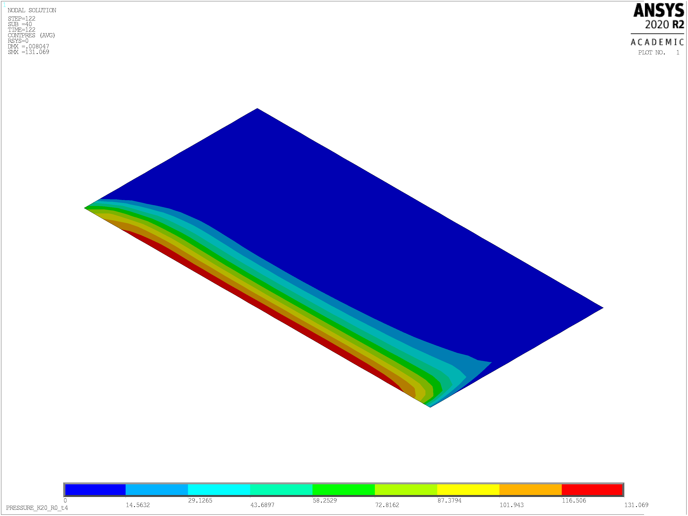

# Three-dimensional aspects of plasticity-induced crack closure: A finite element simulation

This repository contains the code and finite element model used to generate the results and plots of the research article.

```
F. Paysan, E. Breitbarth (2022)
Towards three dimensional aspects of plasticity-induced crack closure: A finite element simulation.
International Journal of Fatigue
DOI: 10.1016/j.ijfatigue.2022.107092
```
The article can be found [here](https://www.sciencedirect.com/science/article/abs/pii/S0142112322003528).

## Abstract

The mutual interactions between intrinsic (damage) and extrinsic (shielding) mechanisms are essential for understanding fatigue crack growth in ductile materials. In the latter case, plasticity-induced crack closure is the dominating retardation mechanism in the Paris regime. The transition between plane strain and plane stress states leads to a locally different fracture surface contact, which is difficult to access during experiments. In this work, plasticity-induced crack closure under constant amplitude loading of an AlCu4Mg (AA2024) aluminium sheet material is studied from a three-dimensional perspective. An elastic–plastic 3D finite element model of an M(T)160 specimen with a bilinear isotropic hardening model is used to study the evolution of plasticity during fatigue crack growth. Cyclic crack propagation is simulated with the releasing-constraint method.

In the results, plasticity-induced crack closure is present up to a load ratio R = 0.3. Detailed investigations of the contact pressure distributions indicate a strong dependence on the stress intensity factors and the sheet thicknesses. The contact pressure distributions on the fracture surface can be divided into three characteristic regions. Near the plastic zone, plastic energy is still induced during the unloading process after the crack is already closed. However, the crack surface contact does not affect the shape of the plastic zone. Additionally, further plastic energy accumulates in the plastic wake region during crack closure within subsequent load cycles, described here as cyclic plastic wake. In summary, the finite element model can reproduce the major features of fatigue crack closure like Kop or Kcl and the three-dimensional and load-dependent evolution of plasticity-induced crack closure.

## Dependencies

- active [ANSYS](https://www.ansys.com/) license
- [Python 3.8.5](https://www.python.org/)

In Python the following imports are needed:
```
import os
import matplotlib.pyplot as plt
```

## Usage

With the help of this guide, the finite element model and the results obtained during the investigations of the referenced publication can be reproduced.

The main model of a middle tension specimen (MT) is mainly defined by the file "00_main.inp". Parameters to adjust geometry, load or material properties are specified in the input file "00_variables" and can thus be set separately.

To start a simulation, enter the following commands in your ANSYS GUI. Here it is mandatory that all required files are located in the same directory.

```
/input,00_main,inp
```

The produced element model is shown in the following figure:


After solving, contact pressure distributions and shape characteristics aspects of the plastic zone are obtainable. 


